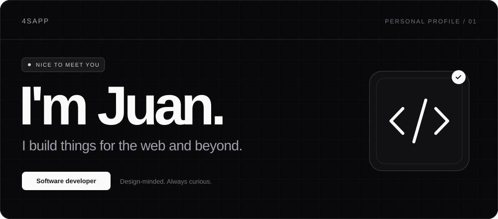

  

### Hi, I'm Juan.

I build web interfaces and fix the small things that make them frustrating to use. My recent work has focused on navigation, application state, and reliable previews.

### Recent contributions

| Project | Work | Pull request |
| :--- | :--- | :--- |
| **[comma.ai · connect](https://github.com/commaai/connect)** | URL-driven navigation and direct links to dialogs, with browser history support. | [#780 · Open for review](https://github.com/commaai/connect/pull/780) |
| **[tscircuit · runframe](https://github.com/tscircuit/runframe)** | Restore the connection indicator after the development server reconnects. Includes regression tests. | [#5592 · Open for review](https://github.com/tscircuit/runframe/pull/5592) |

### Tools I work with

React · TypeScript · JavaScript · Node.js · Bun · Git

I'm interested in product engineering roles and paid open-source work. You can review the changes and test results in the PRs above.
