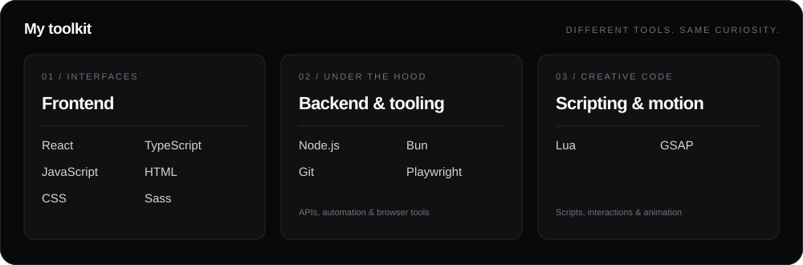

  

### A little about me

I'm **Juan**, a software developer who enjoys building things that look good and work well. I work across web development, scripting, browser extensions, and automation.

I like clean interfaces, useful tools, and figuring out how things work. I move between technologies depending on what I'm building, from React and TypeScript to Node.js and Lua.

 

  

 

  <strong>Open to software engineering roles and freelance work.</strong> 
  Good ideas, thoughtful design, and software worth building.

